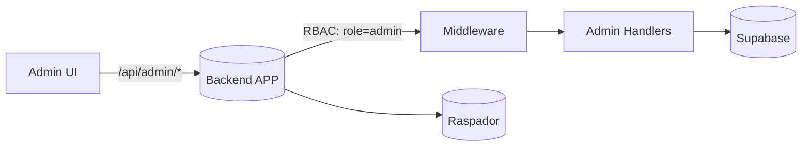

# Área de Administração – Diretrizes

Objetivo: prover gestão segura de usuários, auditorias, dados e operações técnicas (ex.: reindexar processos) sem expor rotinas sensíveis para usuários comuns.

## RBAC (papéis e permissões)
- Papéis iniciais: `admin`, `advogado` (padrão atual)
- Autorização no backend por middleware (ex.: `requireRole('admin')`)
- Persistência: `users.role` e tabela `audit_logs`

### Tabela sugerida: audit_logs
- id (uuid), actor_id (fk users.id), action (string), entity (string), entity_id (string), diff (jsonb), created_at (timestamptz)
- Registrar operações administrativas relevantes

## Endpoints (esboço)
- GET `/api/admin/system/health` → status de serviços (Raspador, Supabase, filas)
- GET `/api/admin/audits` (filtros por actor, action, período)
- GET `/api/admin/users` | POST | PATCH | DELETE → CRUD de usuários
- POST `/api/admin/processes/reindex` { cnj[] } → reimporta/atualiza dados no Supabase

## Rotas de UI
- /admin (dashboard)
- /admin/users (listagem e CRUD)
- /admin/audits (logs)
- /admin/system (visão de saúde/composição)

## Diagrama (alto nível)

## Boas práticas
- Limitar quem pode ver/editar `users.role`
- Logar todas as ações administrativas (audit_logs)
- Respostas com paginação/ordenamento previsíveis
- Não exibir dados sensíveis em telas (mascarar documentos/segredos)
- Testes de autorização (admin NÃO deve vazar para não-admin)

