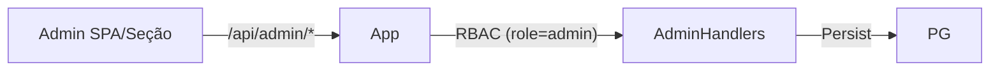

# Arquitetura detalhada

Este documento aprofunda a arquitetura, camadas, contratos e como estender o projeto (ex.: área de administração).

## Diagrama de módulos
```mermaid
flowchart TB
  subgraph Frontend[SPA React (Vite)]
    UI[Pages + Components]
  end
  subgraph App[Backend APP (Express)]
    Auth[Auth + Cookie JWT]
    Proxy[Proxy → Raspador]
  end
  subgraph Raspador[Backend Raspado (Express + Playwright)]
    PW[Playwright Chromium]
    ESAJ[(ESAJ TJSP)]
    Persist[(Supabase)]
  end
  subgraph ChatAPI[Chat API (Express)]
    ChatEndpoints[Consultas Mensagens]
  end
  subgraph Data[(Camada de Dados)]
    PG[(Supabase/Postgres)]
    My[(MySQL - Chat)]
  end

  UI -->|/api/*| App
  App -->|proxy| Raspador
  Raspador -->|Service Role| PG
  ChatAPI --> My
  UI -->|ops/bi| ChatAPI
  PW --> ESAJ
  Persist --> PG

  classDef service fill:#eef,stroke:#88a
  classDef data fill:#efe,stroke:#8a8
  class App,Raspador,ChatAPI service
  class Data,PG,My data
```

## Mapeamento de variáveis → comportamento
- AUTH_SECRET: segredo compartilhado entre App e Raspador para JWT/cookies
- COOKIE_NAME/COOKIE_DOMAIN: nome e escopo do cookie httpOnly
- FRONT_ORIGINS/FRONT_ORIGIN: CORS permitido
- RASPADOR_URL: destino do proxy no App
- SUPABASE_URL/SUPABASE_SERVICE_ROLE_KEY: acesso DB no Raspador/App (somente backend)
- HEADLESS/PW_SLOWMO/TJSP_OTP_TIMEOUT_MS/TJSP_FLOW_TTL_MS: comportamento do Playwright & fluxo

## RBAC e área de administração (visão)


- Recomendação: reutilizar a mesma SPA (rota /admin) com guard `role === 'admin'`.
- Tabelas: `users.role` ("admin"|"advogado"), `audit_logs(id, actor_id, action, entity, entity_id, created_at, diff)`.
- Endpoints esboço: `/api/admin/users`, `/api/admin/audits`, `/api/admin/processes/reindex`, `/api/admin/system/health`.

