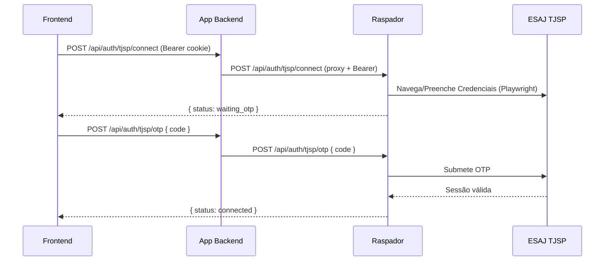
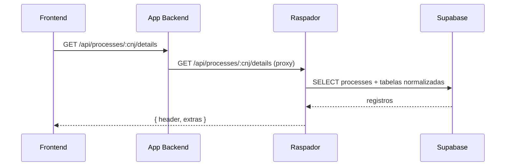
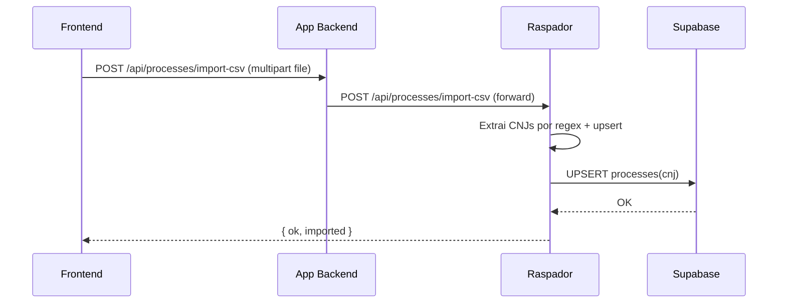

# Fluxos – Autenticação e TJSP

## Login no APP (CPF/CNPJ ou OAB/UF)
```mermaid
sequenceDiagram
  participant F as Frontend
  participant A as App Backend
  participant S as Supabase
  F->>A: POST /api/auth/login { cpfCnpj|oab, uf, password }
  A->>S: SELECT users (by cpf_cnpj ou oab/uf)
  S-->>A: { id, cpf_cnpj, oab, uf, role, password_hash }
  A->>A: bcrypt.compare(password, password_hash)
  A-->>F: Set-Cookie sa_auth=<JWT>; { ok, user }
  F->>A: GET /api/auth/me (cookie)
  A-->>F: { ok, user }
```

## Conexão TJSP (OTP)


## Buscar detalhes de processo


## Importar CSV de CNJs


